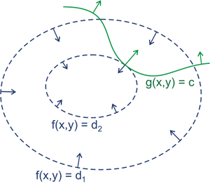

在求解最优化问题中，拉格朗日乘子法（Lagrange Multiplier）和 KKT（Karush Kuhn Tucker）条件是两种最常用的方法。KKT 可以看做拉格朗日乘子法的一种泛化。

1. 在有等式约束时，使用拉格朗日乘子法
2. 在有不等约束时，使用 KKT 条件。

**我们这里提到的最优化问题通常是指对于给定的某一函数，求其在指定作用域上的全局最小值**（因为最小值与最大值可以很容易转化，即最大值问题可以转化成最小值问题）。

# 等式约束条件

设目标函数为 $f(x)$，约束条件为 $h_k(x)$，我们的问题可以表示为

$$
\begin{array}{l}
\min f(x)\\
\text { s.t. } \quad h_{k}(x)=0 \quad k=1,2, \ldots, l
\end{array}
$$

则解决方法是消元法或者拉格朗日法。消元法比较简单不在赘述，这里主要讲拉格朗日法，因为后面提到的KKT条件是对拉格朗日乘子法的一种泛化。

第一步：首先定义拉格朗日函数$F(x)$
$$
F(x, \lambda)=f(x)+\sum_{k=1}^{l} \lambda_{k} h_{k}(x)
$$

第二步：解偏导方程
$$
\frac{\partial F}{\partial x_{i}}=0
$$
$$
\frac{\partial F}{\partial \lambda_{k}}=0
$$

求出的方程组的解就可能是最优化值（高等数学中提到的极值），将结果带回原方程验证就可得到解。

第三步：第二步结果，代入 $f(x)$ 得到最大值

## 举个例子

例如给定椭球：

$$
\frac{x^{2}}{a^{2}}+\frac{y^{2}}{b^{2}}+\frac{z^{2}}{c^{2}}=1
$$

求这个椭球的内接长方体的最大体积。这个问题实际上就是条件极值问题，即在上面的条件下，求  $f(x, y, z)=8 x y z$ 的最大值。

第一步：首先定义拉格朗日函数$F(x)$
$$
\begin{aligned}
F(x, y, z, \lambda) &=f(x, y, z)+\lambda \varphi(x, y, z) \\
&=8 x y z+\lambda\left(\frac{x^{2}}{a^{2}}+\frac{y^{2}}{b^{2}}+\frac{z^{2}}{c^{2}}-1\right)
\end{aligned}
$$

第二步：解偏导方程
$$
\begin{array}{l}
\frac{\partial F(x, y, z, \lambda)}{\partial x}=8 y z+\frac{2 \lambda x}{a^{2}}=0 \\
\frac{\partial F(x, y, z, \lambda)}{\partial y}=8 x z+\frac{2 \lambda y}{b^{2}}=0 \\
\frac{\partial F(x, y, z, \lambda)}{\partial z}=8 x y+\frac{2 \lambda z}{c^{2}}=0 \\
\frac{\partial F(x, y, z, \lambda)}{\partial \lambda}=\frac{x^{2}}{a^{2}}+\frac{y^{2}}{b^{2}}+\frac{z^{2}}{c^{2}}-1=0
\end{array}
$$
解得
$$
x=\frac{\sqrt{3}}{3} a \quad y=\frac{\sqrt{3}}{3} b \quad z=\frac{\sqrt{3}}{3} c
$$

第三步：第二步结果，代入 $f(x)$ 得到最大值
$$
V_{\max }=f\left(\frac{\sqrt{3}}{3} a, \frac{\sqrt{3}}{3} b, \frac{\sqrt{3}}{3} c\right)=\frac{8 \sqrt{3}}{9} a b c
$$

## 拉格朗日法的 intuition

至于为什么这么做可以求解最优化？维基百科上给出了一个比较好的直观解释。

举个二维最优化的例子：
$$
\begin{array}{l}
\min f(x, y) \\
\text { s.t. } g(x, y)=c
\end{array}
$$

这里画出z=f(x,y)的等高线：

绿线标出的是约束g(x,y)=c的点的轨迹。蓝线是f(x,y)的等高线。箭头表示斜率，和等高线的法线平行(等高线的法线就是登高线垂直的线)。从梯度的方向上来看（梯度相当于这个面在各个纬度的斜率），显然有d1>d2。绿色的线是约束，也就是说，只要正好落在这条绿线上的点才可能是满足要求的点。如果没有这条约束，f(x,y)的最小值应该会落在最小那圈等高线内部的某一点上。**而现在加上了约束，最小值点应该在哪里呢？显然应该是在f(x,y)的等高线正好和约束线相切的位置，因为如果只是相交意味着肯定还存在其它的等高线在该条等高线的内部或者外部，使得新的等高线与目标函数的交点的值更大或者更小，只有到等高线与目标函数的曲线相切的时候，可能取得最优值。**

如果我们对约束也求梯度∇g(x,y)，则其梯度如图中绿色箭头所示。要想让目标函数f(x,y)的等高线和约束相切，则他们切点的梯度一定在一条直线上(f和g的斜率平行)。也即在最优化解的时候：

∇f(x,y)=λ(∇g(x,y)-C)

∇ 表示分别求 f 在 x 和 y 上的导数。

也就是 ▽[f(x,y)+λ(g(x,y)−c)]=0 λ≠0

那么拉格朗日函数： F(x,y)=f(x,y)+λ(g(x,y)−c) 在达到极值时与f(x,y)相等，因为F(x,y)达到极值时g(x,y)−c总等于零。

# 不等式约束条件

设目标函数f(x)，不等式约束为g(x)，有的教程还会添加上等式约束条件h(x)。此时的约束优化问题描述如下：

$$
\begin{array}{ll}
\min & f(X) \\
\text { s.t. } & h_{j}(X)=0 \quad j=1,2, \ldots, p \\
& g_{k}(X) \leq 0 \quad k=1,2, \ldots q
\end{array}
$$

第一步：首先定义拉格朗日函数$L(x)$

则我们定义不等式约束下的拉格朗日函数L，则L表达式为：

$$
L(X, \lambda, \mu)=f(X)+\sum_{j=1}^{p} \lambda_{j} h_{j}(X)+\sum_{k=1}^{q} \mu_{k} g_{k}(X)
$$

其中f(x)是原目标函数，hj(x)是第j个等式约束条件，λj是对应的约束系数，gk是不等式约束，uk是对应的约束系数。

第二步：解 KKT 条件
1. L(a, b, x)对x求导为零；
2. h(x) =0;
3. 每个 a*g(x) = 0; （如果 g 不等于 0，a 就要等于 0，看条件 1 和 2 算出来的值代入 3 中是否成立）

第三步：代回原来的 f 求解最小值

## KKT 证明和 intuition

思路：

第一步：先证明 KKT 的第一个条件中我们构造的 L 求导为 0 解出来的 x* 求出来就是 f(x) 极值的 x*，即

$$
L\left(x^{*}, a\right)=\min _{x} L(x, a)
$$

并且此时满足 KKT 条件 3

第二步：要证明上面的东西，我们需要先证明

$$
\min _{x} \max _{\mu} L(x, \mu)=\max _{\mu} \min _{x} L(x, \mu)=\min _{x} f(x)=f\left(x^{*}\right)
$$

具体过程如下面这个文档：

https://www.cnblogs.com/mo-wang/p/4775548.html

